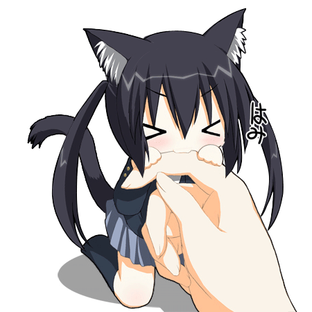

 

# `sangram-net`

**Cybersecurity Student • Linux • Python**

 

  

  

`Linux` • `Networking` • `Cybersecurity` • `Python`

 

<a href="https://github.com/sangram-net">GitHub</a>
  •   <a href="https://www.linkedin.com/in/sangramcloud">LinkedIn</a>

  

